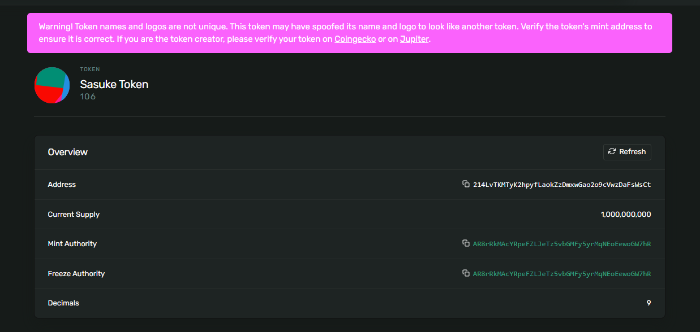

# Sasuke Token 🥷



## Overview
**Sasuke Token (106)** is a test token deployed for experimentation and learning purposes.  
It demonstrates how to create and configure a custom token with metadata on the blockchain.

- **Name:** Sasuke Token  
- **Symbol:** 106  
- **Description:** test token  
- **Category:** image  

## Metadata
```json
{
  "name": "Sasuke Token",
  "symbol": "106",
  "description": "test token",
  "image": "https://i.imgur.com/E7DYYiP.png",
  "attributes": [],
  "properties": {
    "files": [
      {
        "uri": "https://i.imgur.com/E7DYYiP.png",
        "type": "image/png"
      }
    ],
    "category": "image"
  }
}

