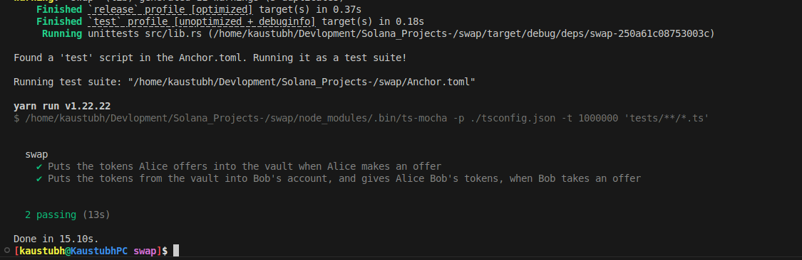

# Swap Program on Solana

This project demonstrates a simple token swap between two users using Solana and Anchor. It handles offers, accepts them, and transfers tokens securely on-chain.

---

## Example Flow

**Users:** Bob and Alex  
**Scenario:** Bob wants to swap **10 USDC** for **100 XRP** from Alex.

1. **Create Offer:**  
   - Bob creates a swap offer.  
   - A **PDA (Program Derived Address)** is generated to store the swap data.  
   - Bob’s **10 USDC** is temporarily locked in the PDA.  

2. **Take Offer:**  
   - Alex accepts the offer.  
   - **Cross-Program Invocations (CPI)** move **100 XRP** from Alex to Bob.  
   - **10 USDC** from the PDA goes to Alex.  

3. **Completion:**  
   - Swap account (PDA) is updated or closed.  
   - Both users receive the exchanged tokens safely.  

**Summary:**  
Bob locks USDC in a PDA → Alex sends XRP → PDA releases USDC to Alex → XRP goes to Bob. Atomic and secure on-chain swap.

---

## Features

- On-chain token swaps using Anchor  
- PDAs for secure swap data storage  
- CPIs to SPL Token program for safe token transfers
