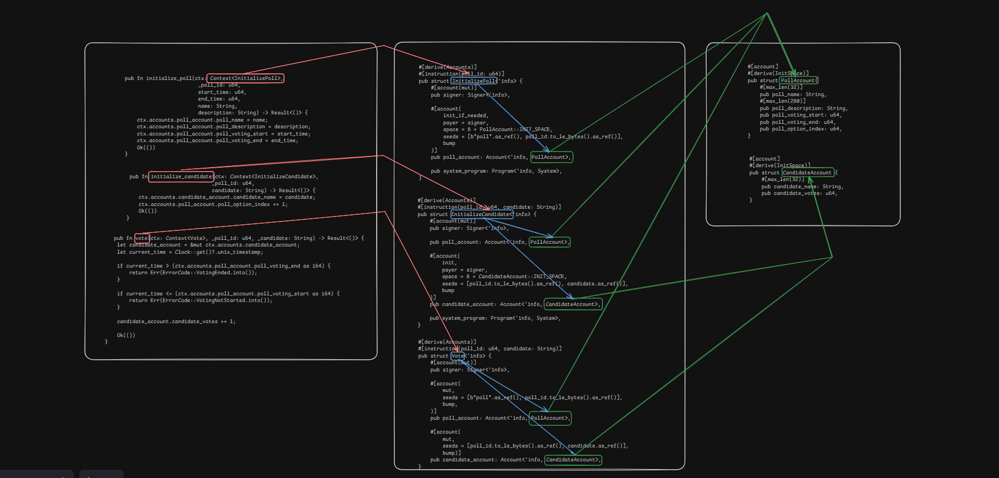

# voting_system

How This Smart Contract Runs

Each smart contract in this repo is built using Rust and the Anchor framework on Solana. Here’s the general flow:
Program Initialization – The contract is deployed on the Solana blockchain, creating program accounts that store data.
Account Setup – Users or program logic initialize accounts (e.g., PDAs) to hold state, like numbers, strings, or arrays.
Instruction Execution – Each function in the contract (called an “instruction”) can be invoked from the frontend or CLI. These instructions update account state, perform computations, or interact with other programs.
Validation & Security – Anchor handles checks like account ownership, signatures, and rent exemptions to ensure safe execution.
Transaction Confirmation – Once an instruction runs successfully, the blockchain confirms the transaction, and the updated data is stored permanently on-chain.
Frontend Interaction – Web apps can call these instructions via RPC calls, letting users interact with the smart contract in real-time.
Each project folder includes screenshots and diagrams showing the exact flow of data, account setup, and instruction execution for that specific contract.
